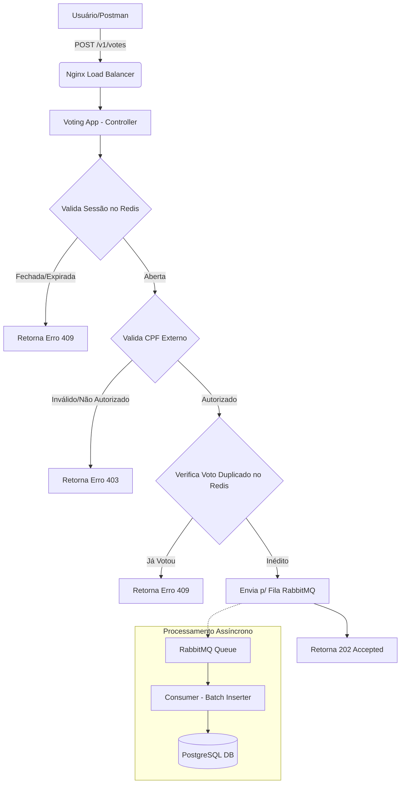

# 🗳️ Sistema de Votação (Desafio Técnico)

Este projeto é uma API REST para gerenciamento de sessões de votação e processamento de votos, focada em alta performance, resiliência e escalabilidade.

---

### 🚀 Tecnologias e Bibliotecas (Libs)

O projeto foi desenvolvido utilizando o ecossistema **Java 21** e **Spring Boot 4.0.2**. Abaixo estão as principais bibliotecas:

*   **Spring Boot Starter Web**: Para criação dos endpoints REST.
*   **Spring Data JPA**: Abstração de persistência de dados.
*   **Spring Data Redis**: Utilizado para cache de validação de sessões e controle de duplicidade de votos em tempo real.
*   **Spring AMQP (RabbitMQ)**: Mensageria assíncrona para processamento de votos em lote (Batch), garantindo vazão e resiliência.
*   **Spring Boot Starter Quartz**: Agendador de tarefas para fechamento automático de sessões de votação.
*   **Spring Validation**: Validação de dados de entrada (Beans).
*   **Liquibase**: Gerenciamento de versionamento do esquema do banco de dados (Migrations).
*   **MapStruct**: Mapeamento performático entre Entidades e DTOs.
*   **Lombok**: Redução de código boilerplate.
*   **PostgreSQL Driver**: Driver de conectividade com o banco de dados relacional.

---

### 🛠️ Ferramentas de Infraestrutura

A solução utiliza uma arquitetura baseada em containers para facilitar o deploy e a escalabilidade:

1.  **PostgreSQL 16**: Banco de dados relacional para persistência de sessões e votos finalizados.
2.  **Redis 7**: Cache de alta performance para validação rápida de CPFs e estados de sessão.
3.  **RabbitMQ 3.13**: Broker de mensagens para desacoplamento e processamento assíncrono.
4.  **Nginx 1.27**: Atuando como Load Balancer/Proxy reverso para a aplicação.
5.  **Docker & Docker Compose**: Orquestração de todos os serviços da stack.
6.  **Maven**: Gerenciador de dependências e build.

---

### 📊 Fluxograma de Votação

Abaixo, o fluxo simplificado de como um voto é processado desde a requisição até a persistência:


---

### ⚙️ Como Executar

1.  Certifique-se de ter o **Docker** e **Docker Compose** instalados.
2.  Na raiz do projeto, execute:
    ```bash
    docker-compose up -d --build
    ```
3.  A API estará disponível em `http://localhost:8080`.

---

### 📋 Principais Funcionalidades
- **Abrir Sessão**: Define um tempo de duração (default 1 min).
- **Votar**: Validação de CPF, duplicidade e processamento assíncrono.
- **Resultado**: Contabilização de votos por sessão.
