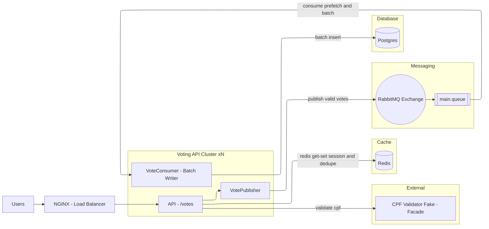
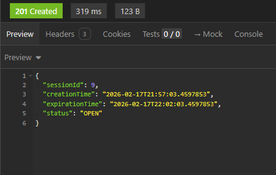
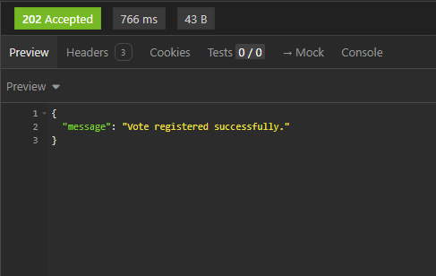
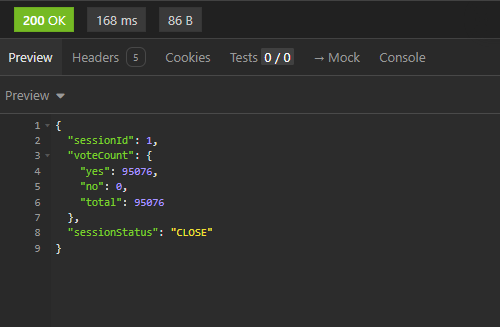
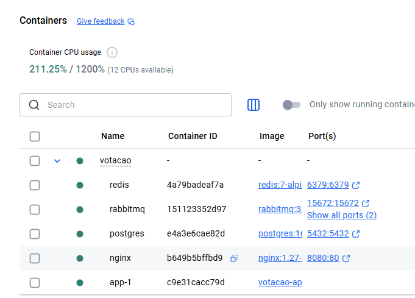

# 🗳️ Sistema de Votação (Desafio Técnico)

Este projeto é uma API REST para gerenciamento de sessões de votação e processamento de votos, focada em alta performance, resiliência e escalabilidade.

---

### 🚀 Tecnologias e Bibliotecas (Libs)

O projeto foi desenvolvido utilizando o ecossistema **Java 21** e **Spring Boot 4.0.2**. Abaixo estão as principais bibliotecas:

*   **Spring Boot Starter Web**: Para criação dos endpoints REST.
*   **Spring Data JPA**: Abstração de persistência de dados.
*   **Spring Data Redis**: Utilizado para cache de validação de sessões e controle de duplicidade de votos em tempo real.
*   **Spring AMQP (RabbitMQ)**: Mensageria assíncrona para processamento de votos em lote (Batch), garantindo vazão e resiliência.
*   **Spring Boot Starter Quartz**: Agendador de tarefas para fechamento automático de sessões de votação.
*   **Spring Validation**: Validação de dados de entrada (Beans).
*   **Liquibase**: Gerenciamento de versionamento do esquema do banco de dados (Migrations).
*   **MapStruct**: Mapeamento performático entre Entidades e DTOs.
*   **Lombok**: Redução de código boilerplate.
*   **PostgreSQL Driver**: Driver de conectividade com o banco de dados relacional.

---

### 🛠️ Ferramentas de Infraestrutura

A solução utiliza uma arquitetura baseada em containers para facilitar o deploy e a escalabilidade:

1.  **PostgreSQL 16**: Banco de dados relacional para persistência de sessões e votos finalizados.
2.  **Redis 7**: Cache de alta performance para validação rápida de CPFs e estados de sessão.
3.  **RabbitMQ 3.13**: Broker de mensagens para desacoplamento e processamento assíncrono.
4.  **Nginx 1.27**: Atuando como Load Balancer/Proxy reverso para a aplicação.
5.  **Docker & Docker Compose**: Orquestração de todos os serviços da stack.
6.  **Maven**: Gerenciador de dependências e build.

---

### 📊 Fluxograma de Votação

Abaixo, o fluxo simplificado de como um voto é processado desde a requisição até a persistência:


---

### 🏛️ Justificativa Técnica (Decisões de Projeto)

Esta arquitetura foi desenhada para suportar cenários reais de votação em massa, priorizando a escalabilidade horizontal e a proteção dos recursos de armazenamento.

#### 1. Quais os Pontos Críticos?
*   **Volumetria e Picos de Acesso:** Necessidade de processar centenas de milhares de votos por minuto sem degradar o tempo de resposta (latência).
*   **Concorrência e Integridade:** Garantir que as regras de negócio (voto único por CPF e sessão ativa) sejam respeitadas mesmo sob altíssima concorrência simultânea.
*   **Gargalo de Persistência:** Evitar o travamento do banco de dados relacional (PostgreSQL) por excesso de conexões e transações individuais de escrita.
*   **Disponibilidade e Resiliência:** O sistema deve continuar aceitando votos mesmo se o banco de dados ou serviços externos estiverem temporariamente lentos.

#### 2. Como esses pontos foram solucionados?

*   **Processamento Assíncrono (RabbitMQ):**
    *   **Detalhe:** Em vez de realizar o `INSERT` no banco durante a requisição HTTP, o voto é validado e postado em uma fila.
    *   **Benefício:** A API responde `202 Accepted` em milissegundos. Isso evita o acúmulo de threads no Spring Boot e permite que o sistema suporte picos de carga sem "derrubar" o servidor.

*   **Validação em Memória - Redis como "Escudo":**
    *   **Detalhe:** Todas as validações críticas (A sessão está aberta? Este CPF já votou?) são feitas contra o **Redis**.
    *   **Benefício:** Como o Redis opera em memória, a validação leva menos de 1ms. Isso protege o PostgreSQL de consultas repetitivas de leitura, reservando-o apenas para a persistência final dos dados válidos.

*   **Escrita Otimizada em Lote (JDBC Batching):**
    *   **Detalhe:** O consumidor da fila não insere um voto por vez. Ele agrupa centenas de votos em memória e realiza um único comando de `Batch Insert` via JDBC.
    *   **Benefício:** Reduz drasticamente o número de transações e o overhead de rede/disco no PostgreSQL, aumentando a vazão de escrita em até 10x em comparação com inserções individuais.

*   **Controle Temporal de Sessões (Quartz Scheduler):**
    *   **Detalhe:** O Quartz é utilizado para gerenciar o estado das sessões de forma precisa e persistente.
    *   **Benefício:** Garante que, assim que o tempo de votação expire, a sessão seja marcada como fechada no banco e no cache, mantendo a consistência mesmo se a aplicação for reiniciada.

*   **Balanceamento e Camada de Rede (Nginx):**
    *   **Detalhe:** O Nginx atua como porta de entrada, distribuindo o tráfego e protegendo a aplicação de conexões diretas.
    *   **Benefício:** Facilita a escalabilidade horizontal (adicionar mais instâncias da App) e melhora a segurança.

---

### ⚙️ Como Executar

1.  Certifique-se de ter o **Docker** e **Docker Compose** instalados.
2.  Na raiz do projeto, execute:
    ```bash
    docker-compose up -d --build
    ```
3.  A API estará disponível em `http://localhost:8080`.
4. Para subir mais de uma instancia:
   ```bash
    docker compose up -d --scale app=2
    ```

---

### 📋 Principais Funcionalidades
- **Abrir Sessão**: Define um tempo de duração (default 1 min).
- **Votar**: Validação de CPF, duplicidade e processamento assíncrono.
- **Resultado**: Contabilização de votos por sessão.

---

### Curl para testar as endpoints

1. Criar pauta:

curl --request POST \
--url http://localhost:8081/api/session \
--header 'Content-Type: application/json' \
--data '{
"description": "Pauta",
"votingTimeMinutes": 5
}'



2. Votar:

curl --request POST \
--url http://localhost:8081/api/votes \
--header 'Content-Type: application/json' \
--data '{
"sessionId": 9,
"cpf": "59186232134",
"vote": "YES"
}'



3. Buscar Resultado:

curl --request GET \
--url http://localhost:8080/api/session/result/1



---

### Docker Container



---